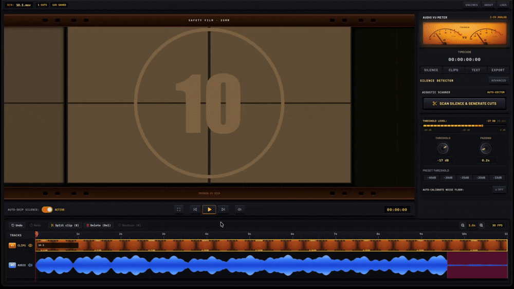

<div align="center">
  
  <h1>TrimBin 1.0.0</h1>
  <p><b>Silence removal and rough-cut editor powered by auto-editor and whisper.</b></p>
  <p>Cuts dead air out of gaming sessions, podcasts, and talking-head recordings. Everything runs locally, no cloud.</p>
</div>



---

### Features

- **Silence detection** — auto-calibrates noise floor via FFmpeg RMS audio analysis or manual dB threshold
- **Whisper transcription** — local speech-to-text with interactive subtitle viewer & timecode sync (tiny/base/small/medium/turbo)
- **Timeline editing** — split tool (B), ripple delete (Del), silence restore (R), undo/redo
- **Smart skip** — preview cuts seamlessly in real-time 60fps playback
- **NLE export** — Premiere Pro XML, DaVinci Resolve FCPXML, Final Cut Pro, Kdenlive, Shotcut
- **Direct render** — MP4, MOV, MKV, WAV, MP3 via FFmpeg
- **Dependency manager** — auto-detects and installs auto-editor, whisper, ffmpeg

---

### Download

| Platform | File | Type |
|---|---|---|
| macOS | `TrimBin-1.0.0-arm64-mac.dmg` | Drag-and-drop installer (Apple Silicon) |
| macOS | `TrimBin-1.0.0-arm64-mac.pkg` | Standard package installer (Apple Silicon) |
| macOS | `TrimBin-1.0.0-arm64-mac.zip` | Standalone archive |
| Windows | `TrimBin.Setup.1.0.0.exe` | NSIS installer |
| Windows | `TrimBin.1.0.0.exe` | Portable executable |
| Linux | `TrimBin-1.0.0.AppImage` | Standalone AppImage |
| Linux | `TrimBin-1.0.0.tar.gz` | Compressed archive |

---

### Supported formats

- **Input:** mp4, mov, mkv, avi, webm, m4v, flv, ts, wav, mp3, aac, m4a, flac, ogg, opus
- **Export:** FCP7 XML, FCPXML, Kdenlive/MLT, SRT, VTT, JSON, MP4, MOV, MKV, WAV, MP3

---

### macOS Installation Note
If macOS Gatekeeper says the app is "damaged", run:
```bash
xattr -cr /Applications/TrimBin.app
```
or right-click > Open.

---

## Dev setup

Requires Node 18+, Bun, Python 3.10+, `auto-editor >= 31.5.0`, `openai-whisper`, `ffmpeg`.

```bash
pip install --upgrade "auto-editor>=31.5.0" openai-whisper

git clone https://github.com/Cri-lab-code/TrimBin.git
cd TrimBin
bun install && cd frontend && bun install && cd ..

bun run start
```

---

## Build

- macOS: `npm run dist:mac`
- Windows: `npm run dist:win`
- Linux: `npm run dist:linux`
- All: `npm run dist`

---

## Credits

Built on [auto-editor](https://github.com/wyattblue/auto-editor) by WyattBlue, [Whisper](https://github.com/openai/whisper) by OpenAI, [FFmpeg](https://ffmpeg.org).

MIT License — see [LICENSE](LICENSE).
